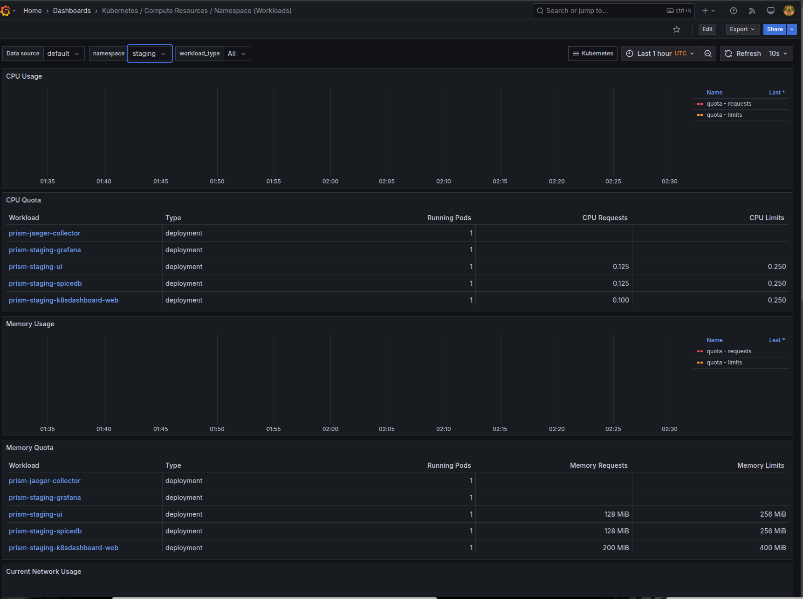

## Autogenerating Helm Chart Documentation with `helm-docs`

The documentation for the Prism Helm charts in `charts/prism/README.md` is generated automatically using `helm-docs`. It extracts metadata and values from `Chart.yaml` and `values.yaml`. If you make changes to the charts, you need to update the documentation accordingly.

### **Prerequisites**

Before you begin, ensure you have `helm-docs` installed on your machine. If not, follow these steps:

1. **Install `helm-docs`**

   The easiest way to install `helm-docs` is by using the `go` command:

   ```bash
   go install github.com/norwoodj/helm-docs/cmd/helm-docs@latest
   ```

   If you don't have Go installed, follow the [Go installation guide](https://golang.org/doc/install).

2. **Navigate to Your Project Directory**

   Navigate to the root directory where the Helm charts are stored. For this project, it would be:

   ```bash
   cd devops
   ```

3. **Run the `helm-docs` Command**

   Generate or update the Helm chart documentation by running:

   ```bash
   helm-docs
   ```

   This command will parse through the charts in the `charts` directory and update the `charts/prism/README.md` file to reflect the latest chart metadata and values.

   Note: The output you’ll see may vary, but a successful run typically looks something like this:

   ```bash
    INFO[2024-09-11T11:34:20+03:00] Found Chart directories [charts/prism]
    INFO[2024-09-11T11:34:20+03:00] Generating README Documentation for chart charts/prism
   ```

4. **Review, Commit, and Push Your Changes**

   After `helm-docs` has updated the documentation, review the changes to ensure everything looks correct. Then, commit the changes to your Git repository:

   ```bash
   git add charts/prism/README.md
   git commit -m "Update Helm chart documentation"
   git push origin <your-branch>
   ```

   Replace `<your-branch>` with the name of the branch you’re working on.

## Prism Deployment & Cluster Administration

### `kubectl` Commands

- `kubectl get pods` – List all pods in the current namespace
- `kubectl get svc` – List all services
- `kubectl get nodes` – List cluster nodes
- `kubectl describe pod <pod-name>` – Show detailed info about a pod
- `kubectl logs <pod-name>` – View logs from a pod
- `kubectl exec -it <pod-name> -- /bin/sh` – Access a running container shell
- `kubectl get namespaces` - List all namespaces
- `kubectl create namespace <namespace-name>` - Create a namespace
- `kubectl delete namespace <namespace-name>` - Delete a namespace and all it's resources
- `kubectl delete all --all -n <namespace-name>` - Delete all resources in a namespace
- `kubectl delete pods --all -n <namespace-name>` - Delete all pods in namespace
- `kubectl delete pv --all` - Delete all persistent volume
- `kubectl delete pvc --all -n <namespace-name>` - Delete all persistent volume claims in the namespace

### Kubernetes Info

- Kubernetes is a container orchestration platform
- Pods are the smallest deployable units
- Services expose your deployments to other services or the internet
- Namespaces isolate environments

## Prism Deployment

### Intro

#### Requirements

- A DigitalOcean Kubernetes (DOKS) cluster
- A DigitalOcean Personal Access Token with admin permissions

#### Deployment Overview

Prism uses environment-specific pull deployment strategy using ArgoCD for GitOps to ensure smooth updates while minimizing downtime and risks associated with new releases.
For a new release simply update the Prism Charts Repo for example with version number for a deployment and argo will sync the change inside the cluster.

- **Argo Rollouts** for canary strategy to manage the strategies.
- The pipeline involves updating manifests & ArgoCD syncs from repo
- **Backup** with Velero to ensure cluster state safety
- **Observability and Monitoring** with Prometheus and Grafana

The Argo Rollout dashboard is routed through traefik ingress routes and can be accessed at https://<dns>:3100.

### Setting Up / Preparing the Cluster

#### Initialize `doctl` and Auth Context

Make sure doctl is installed. If not, follow the guide here to install and create the PAT with cluster scope access https://docs.digitalocean.com/reference/doctl/how-to/install/

```bash
doctl auth init
# Paste your token when prompted
doctl kubernetes cluster kubeconfig save <cluster_id>
```

#### Create the required namespaces

```bash
kubectl create namespace staging
kubectl create namespace argocd
kubectl create namespace argo-rollouts
```

#### Create GHCR Secret

Create the k8s secret for github registry auth token

```bash
kubectl create secret docker-registry ghcr-secret \
  --docker-server=ghcr.io \
  --docker-username=<username> \
  --docker-password=<token> \
  --docker-email=<email> \
  -n staging
```

#### Install ArgoCD CRDs

To install ArgoCD in the cluster run the following command:

```bash
kubectl apply -n argocd -f https://raw.githubusercontent.com/argoproj/argo-cd/stable/manifests/install.yaml
```

The installation manifests include ClusterRoleBinding resources that reference `argocd` namespace.
If you are installing Argo CD into a different namespace then make sure to update the namespace reference.

#### Install Argo Rollouts CRDs

```bash
kubectl apply -n argo-rollouts -f https://github.com/argoproj/argo-rollouts/releases/latest/download/install.yaml
```

#### Install VPA Components

```bash
git clone https://github.com/kubernetes/autoscaler.git
cd autoscaler/vertical-pod-autoscaler
./hack/vpa-down.sh
./hack/vpa-up.sh
```

### 3. Deploying Prism by installing argo application

#### Apply ArgoCD Config for Prism

Apply the ArgoCD configuration file `./charts/prism/templates/argocd.yaml`

```bash
kubectl apply -f ./charts/prism/templates/argocd.yaml
```

#### Update Secrets

Encode your secrets in base64 and replace values in all the secret manifest files:

```bash
echo -n "<your-secret>" | base64
```

Apply secrets:

```bash
kubectl apply -f ./charts/prism/templates/<secret_file>.yaml
```

Pay close attention to ./charts/prism/templates/backends-secrets.yaml otherwise provisioning cvms will fail.

#### Update DNS

- After provisioning, get LoadBalancer IP:

```bash
kubectl get svc -n staging
```

- Update your DNS records to point to this IP

### 4️Maintenance

#### Uninstall ArgoCD Application

```bash
kubectl delete -f ./charts/prism/templates/argocd.yaml
```

#### Remove Stuck Argo Application

```bash
kubectl delete application <app-name> -n argocd
kubectl delete namespace staging
```

#### Pushing Updates and new versions

1. Update manifests
2. Push changes to helm repo
3. ArgoCD auto-syncs with new changes and updates the cluster resources

#### Rollbacks

To handle unexpected failures or issues during deployment, a **rollback strategy** is implemented within ArgoCD. Simply revert the last commit for the respective environment.
This ensures that if a deployment fails at any stage, the system can automatically revert to the last stable version.

Rollback also be done on the argo ui by clicking on the History and Rollback button, allowing you to access previous deployments and view all the syncs that Argo has performed.
This screen provides an option to restore an older version, which can be useful if a deployment introduces a bug.
By rolling back to a previous version, you can avoid incidents in production until the issue has been resolved.

#### ArgoCD UI Login

```bash
kubectl get secret -n argocd argocd-initial-admin-secret -o yaml
echo <base64-password> | base64 --decode
```

Access: `https:<dns>:8085/`

#### Kubernetes Dashboard

The file `kubernetes-dashboard-service-account.yaml` defines the service account, secret and cluster role binding resources necessary for accessing the deployment release via kubernetes dashboard.
This creates a Service Account that is needed for authenticating into the dashboard. You'll need to generate a token for this account.

The Kubernetes Dashboard charts are bundled and install together with prism charts.
Visit: `https://<dns>:9200`

To retrieve the token that we can use to log in.

```bash
kubectl -n staging create token admin-user
```

It should print something like:

```bash
eyJhbGciOiJSUzI1NiIsImtpZCI6IiJ9.eyJpc3MiOiJrdWJlcm5ldGVzL3NlcnZpY2VhY2NvdW50Iiwia3ViZXJuZXRlcy5pby9zZXJ2aWNlYWNjb3VudC9uYW1lc3BhY2UiOiJrdWJlcm5ldGVzLWRhc2hib2FyZCIsImt1YmVybmV0ZXMuaW8vc2VydmljZWFjY291bnQvc2VjcmV0Lm5hbWUiOiJhZG1pbi11c2VyLXRva2VuLXY1N253Iiwia3ViZXJuZXRlcy5pby9zZXJ2aWNlYWNjb3VudC9zZXJ2aWNlLWFjY291bnQubmFtZSI6ImFkbWluLXVzZXIiLCJrdWJlcm5ldGVzLmlvL3NlcnZpY2VhY2NvdW50L3NlcnZpY2UtYWNjb3VudC51aWQiOiIwMzAzMjQzYy00MDQwLTRhNTgtOGE0Ny04NDllZTliYTc5YzEiLCJzdWIiOiJzeXN0ZW06c2VydmljZWFjY291bnQ6a3ViZXJuZXRlcy1kYXNoYm9hcmQ6YWRtaW4tdXNlciJ9.Z2JrQlitASVwWbc-s6deLRFVk5DWD3P_vjUFXsqVSY10pbjFLG4njoZwh8p3tLxnX_VBsr7_6bwxhWSYChp9hwxznemD5x5HLtjb16kI9Z7yFWLtohzkTwuFbqmQaMoget_nYcQBUC5fDmBHRfFvNKePh_vSSb2h_aYXa8GV5AcfPQpY7r461itme1EXHQJqv-SN-zUnguDguCTjD80pFZ_CmnSE1z9QdMHPB8hoB4V68gtswR1VLa6mSYdgPwCHauuOobojALSaMc3RH7MmFUumAgguhqAkX3Omqd3rJbYOMRuMjhANqd08piDC3aIabINX6gP5-Tuuw2svnV6NYQ
```

Log In to Dashboard: Access the URL in your local web browser at https://<dns>:9200/, and log in using the token you generated for your service account.

Explore and Manage: You'll now have access to the Kubernetes Dashboard's intuitive interface. From here, you can explore your cluster's resources, view pod details, manage deployments, and monitor the health of your cluster.

### 5. Monitoring

For monitoring, we use the kube-prometheus-stack which is meant for cluster monitoring, so it is pre-configured to collect metrics from all Kubernetes components.
In addition to that it delivers a default set of dashboards and alerting rules.
Many of the useful dashboards and alerts come from the kubernetes-mixin project.

The kube-prometheus-stack consists of three main components:

1. **Prometheus Operator**, for spinning up and managing Prometheus instances in your DOKS cluster.
2. **Grafana**, for visualizing metrics and plot data using stunning dashboards.
3. **Alertmanager**, for configuring various notifications (e.g. PagerDuty, Slack, email, etc) based on various alerts received from the Prometheus main server

#### Prometheus Dashboard

Visit: `https://<dns>:9090`
To see what targets were discovered by Prometheus, please navigate to http://<dns>:9090/targets.

#### Grafana Dashboard

Visit: `https://<dns>:3000`
Next, launch a web browser of your choice, and enter the following URL: https://localhost:3000.
You can take a look around, and see what dashboards are available for you to use from the kubernetes-mixin project as an example, by navigating to the following URL: http://<dns>:3000/dashboards?tag=kubernetes-mixin.

Auth credentials for grafana can be found in `charts/prims/values.yaml`.



### 6. Appendix

#### Ingress Entry Points Table

| Entry Point Port | Description    | Target Service                    |
| ---------------- | -------------- | --------------------------------- |
| 80               | HTTP traffic   | Traefik routing. Redirects to 443 |
| 443              | HTTPS traffic  | TLS secured services              |
| 8080             | Treafik port   | Traefik Dashboard                 |
| 9090             | Prometheus     | Monitoring dashboard              |
| 3000             | Grafana        | Visualization                     |
| 3100             | Argo Dashboard | Canary strategy manager           |
| 9200             | k8s Dashboard  | Kubernetes dashboard              |
